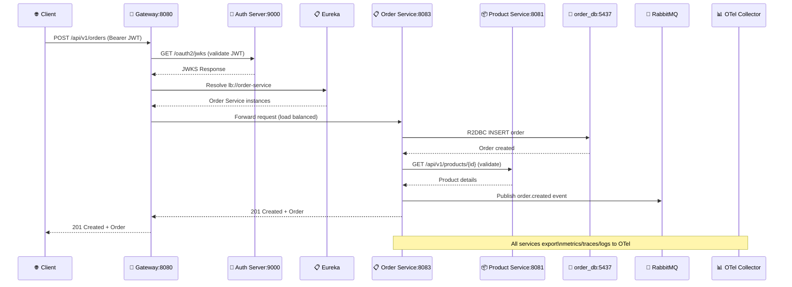

# Architecture Diagram

This document contains the Mermaid diagram representing the actual architecture of the Spring Cloud Microservices Platform.

## System Architecture

```mermaid
flowchart TB
    subgraph Client["Client Layer"]
        Browser["🌐 Browser / Client App"]
    end

    subgraph GatewayLayer["API Gateway Layer"]
        Gateway["🚪 Gateway :8080\nSpring Cloud Gateway\nOAuth2 Resource Server\nRedis Reactive + Resilience4j"]
    end

    subgraph Auth["Authorization"]
        AuthServer["🔐 Auth Server :9000\nSpring Authorization Server\nWebMVC + JPA + Flyway\nPostgreSQL (auth_db)"]
    end

    subgraph Infra["Infrastructure"]
        ConfigServer["⚙️ Config Server :8888\nSpring Cloud Config (Git backend)"]
        Eureka["📋 Eureka Server :8761\nService Discovery"]
        OTel["📊 OTel Collector :4317/4318\nOpenTelemetry → Splunk"]
        RabbitMQ["📨 RabbitMQ :5672/15672\nEvent Bus"]
    end

    subgraph Databases["Databases (Per Service)"]
        MongoDB[("🍃 MongoDB :27017\nproduct_db")]
        PgCategory[("🐘 PostgreSQL :5436\ncategory_db")]
        PgOrder[("🐘 PostgreSQL :5437\norder_db")]
        PgInventory[("🐘 PostgreSQL :5433\ninventory_db")]
        PgPayment[("🐘 PostgreSQL :5438\npayment_db")]
        PgNotification[("🐘 PostgreSQL :5434\nnotification_db")]
        PgAuth[("🐘 PostgreSQL :5432\nauth_db")]
    end

    subgraph Services["Business Services"]
        Product["📦 Product Service :8081\nWebFlux + MongoDB Reactive\nAMQP"]
        Category["📂 Category Service :8082\nWebMVC + JPA + Flyway\nAMQP"]
        Order["📋 Order Service :8083\nWebFlux + R2DBC + Flyway\nResilience4j + AMQP"]
        Inventory["📊 Inventory Service :8084\nWebMVC + JPA + Flyway\nResilience4j + AMQP"]
        Payment["💳 Payment Service :8086\nWebFlux + R2DBC + Flyway\nResilience4j + AMQP"]
        Notification["📧 Notification Service :8087\nWebMVC + JPA + Mail\nAMQP"]
    end

    %% Connections
    Browser -->|HTTPS| Gateway
    Gateway -.->|JWKS Validation| AuthServer
    Gateway -->|lb://service| Product
    Gateway -->|lb://service| Category
    Gateway -->|lb://service| Order
    Gateway -->|lb://service| Inventory
    Gateway -->|lb://service| Payment
    Gateway -->|lb://service| Notification
    Gateway -->|lb://service| AuthServer

    %% Service Discovery
    Product -.->|register| Eureka
    Category -.->|register| Eureka
    Order -.->|register| Eureka
    Inventory -.->|register| Eureka
    Payment -.->|register| Eureka
    Notification -.->|register| Eureka
    AuthServer -.->|register| Eureka
    Gateway -.->|register| Eureka

    %% Config
    Product -.->|fetch config| ConfigServer
    Category -.->|fetch config| ConfigServer
    Order -.->|fetch config| ConfigServer
    Inventory -.->|fetch config| ConfigServer
    Payment -.->|fetch config| ConfigServer
    Notification -.->|fetch config| ConfigServer
    AuthServer -.->|fetch config| ConfigServer
    Gateway -.->|fetch config| ConfigServer
    Eureka -.->|fetch config| ConfigServer

    %% Databases
    Product --> MongoDB
    Category --> PgCategory
    Order --> PgOrder
    Inventory --> PgInventory
    Payment --> PgPayment
    Notification --> PgNotification
    AuthServer --> PgAuth

    %% Event Bus (Async)
    Product -->|product.events| RabbitMQ
    Category -->|category.events| RabbitMQ
    Order -->|order.events| RabbitMQ
    Inventory -->|inventory.events| RabbitMQ
    Payment -->|payment.events| RabbitMQ
    Notification -->|notification.events| RabbitMQ

    %% Observability
    Product -->|metrics/traces/logs| OTel
    Category -->|metrics/traces/logs| OTel
    Order -->|metrics/traces/logs| OTel
    Inventory -->|metrics/traces/logs| OTel
    Payment -->|metrics/traces/logs| OTel
    Notification -->|metrics/traces/logs| OTel
    AuthServer -->|metrics/traces/logs| OTel
    Gateway -->|metrics/traces/logs| OTel
    Eureka -->|metrics/traces/logs| OTel
    ConfigServer -->|metrics/traces/logs| OTel

    %% Styling
    classDef gateway fill:#1f77b4,color:#fff
    classDef auth fill:#ff7f0e,color:#fff
    classDef infra fill:#2ca02c,color:#fff
    classDef db fill:#d62728,color:#fff
    classDef svc fill:#9467bd,color:#fff
    classDef client fill:#8c564b,color:#fff

    class Gateway gateway
    class AuthServer auth
    class ConfigServer,Eureka,OTel,RabbitMQ infra
    class MongoDB,PgCategory,PgOrder,PgInventory,PgPayment,PgNotification,PgAuth db
    class Product,Category,Order,Inventory,Payment,Notification svc
    class Browser client
```



## Request Flow: Authenticated Order Placement



## Service Technology Matrix

| Service | Port | Framework | Database | DB Port | Reactive? | Circuit Breaker |
|---------|------|-----------|----------|---------|-----------|-----------------|
| Gateway | 8080 | Spring Cloud Gateway (WebFlux) | Redis | 6379 | ✅ | Resilience4j |
| Auth Server | 9000 | Spring Auth Server (WebMVC) | PostgreSQL | 5432 | ❌ | - |
| Product | 8081 | WebFlux | MongoDB | 27017 | ✅ | - |
| Category | 8082 | WebMVC | PostgreSQL | 5436 | ❌ | - |
| Order | 8083 | WebFlux | PostgreSQL (R2DBC) | 5437 | ✅ | Resilience4j |
| Inventory | 8084 | WebMVC | PostgreSQL | 5433 | ❌ | Resilience4j |
| Payment | 8086 | WebFlux | PostgreSQL (R2DBC) | 5438 | ✅ | Resilience4j |
| Notification | 8087 | WebMVC | PostgreSQL | 5434 | ❌ | - |
| Config Server | 8888 | Spring Cloud Config | - | - | - | - |
| Eureka | 8761 | Netflix Eureka | - | - | - | - |

## Database-per-Service Pattern

Each service owns its **dedicated database instance** (no shared schemas):

```
┌─────────────┐     ┌──────────────────┐
│   Service   │────▶│  Database        │
├─────────────┤     ├──────────────────┤
│ Product     │     │ MongoDB:27017    │
│ Category    │     │ PostgreSQL:5436  │
│ Order       │     │ PostgreSQL:5437  │
│ Inventory   │     │ PostgreSQL:5433  │
│ Payment     │     │ PostgreSQL:5438  │
│ Notification│     │ PostgreSQL:5434  │
│ Auth Server │     │ PostgreSQL:5432  │
└─────────────┘     └──────────────────┘
```

## Communication Patterns

| Pattern | Implementation | Used By |
|---------|---------------|---------|
| **Synchronous (REST)** | `WebClient` / `RestClient` with `@LoadBalanced` | Order→Product, Gateway→Services |
| **Asynchronous (Events)** | RabbitMQ (topic exchanges) | All services publish/consume domain events |
| **Service Discovery** | Eureka + Spring Cloud LoadBalancer | All client-side load balancing |
| **Configuration** | Config Server (Git backend) + `bootstrap.yml` | All services |
| **Security** | OAuth2 JWT (validated at Gateway, propagated downstream) | All services |
| **Observability** | Micrometer + OTel → Splunk | All services |